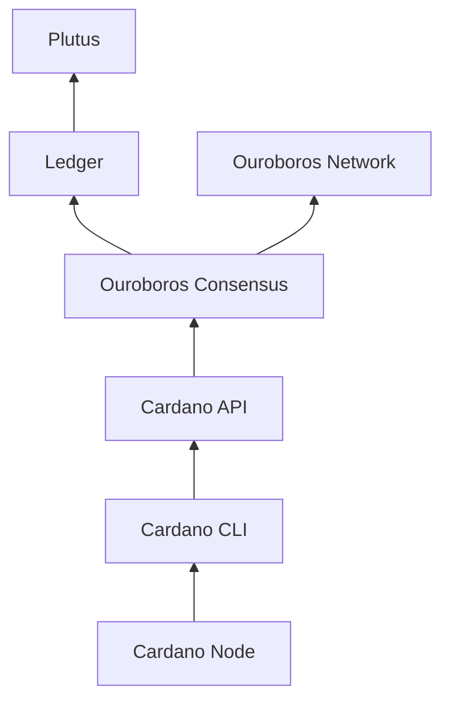

## Dependency Tree

- An arrow means "depends on"

# Release Process for Cardano Node vX.Y.Z

| Component                                                      | Integration Owner   | Release Issue     |
|----------------------------------------------------------------|---------------------|-------------------|
| [Plutus](https://github.com/IntersectMBO/plutus)               | @\<github-username\>| [Link](#)   |
| [Ledger](https://github.com/IntersectMBO/cardano-ledger)       | @\<github-username\>| [Link](#)   |
| [Ouroboros Network](https://github.com/IntersectMBO/ouroboros-network) | @\<github-username\>| [Link](#)   |
| [Ouroboros Consensus](https://github.com/IntersectMBO/ouroboros-consensus) | @\<github-username\>| [Link](#)   |
| [Cardano API](https://github.com/IntersectMBO/cardano-api)     | @\<github-username\>| [Link](#)   |
| [Cardano CLI](https://github.com/IntersectMBO/cardano-cli)     | @\<github-username\>| [Link](#)   |
| [Cardano Node](https://github.com/IntersectMBO/cardano-node)   | @\<github-username\>| [Link](#)   |

## Status

- [ ] Plutus Ledger API is integrated into the Ledger.
- [ ] Ledger is integrated into the Ouroboros Consensus. 
- [ ] Ouroboros Network is integrated into the Ouroboros Consensus.
- [ ] Outroboros Consensus is integrated into the Cardano API.
- [ ] Cardano API is integrated into the Cardano CLI.
- [ ] Cardano CLI is integrated into the Cardano Node.

