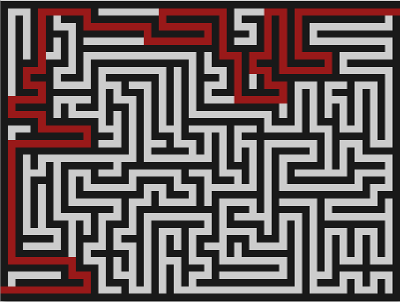

MazeGenerator
=============

A 2D maze generator + solver with OpenGL display in Haskell.

This program is published for its (hopefully) educational value.
Its aim is to give an example of how a naive implementation of
an algorithm is still perfectly readable in plain Haskell code.

The example chosen was [Depth-first search w/ recursive backtracking](http://en.wikipedia.org/wiki/Maze_generation#Recursive_backtracker).
Please refer to comments inside the program text to see how the pieces all come together.


Usage
=====

```git clone``` the repo, ```cd``` into it and type ```cabal run```.

An OpenGL graphic window will pop up, be aMAZEd! Also, by the clever usage of that dad joke.



The console shows which key bindings are available to you:
```
(Space)              - create new maze
(Enter)              - solve maze (animated)
(Arrow left/right)   - adjust maze width
(Arrow up/down)      - adjust maze height
+, -                 - change maze pattern via generation bias
F1                   - toggle step-by-step animated maze creation
Esc                  - quit
```

So go ahead, try out everything, and enjoy the pretty visuals! 
