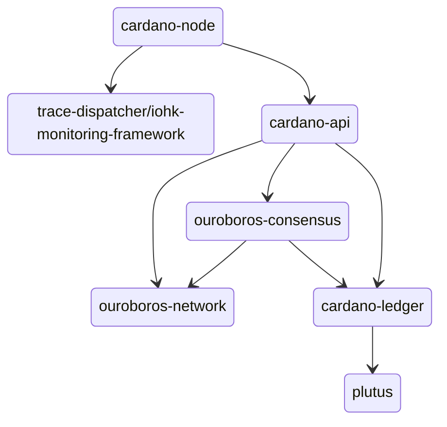

  
  
  

# `cardano-node`

The `cardano-node` repository is the point of integration of the
[ledger](https://github.com/IntersectMBO/cardano-ledger),
[consensus](https://github.com/IntersectMBO/ouroboros-consensus),
[networking](https://github.com/IntersectMBO/ouroboros-network)
and [logging](https://github.com/IntersectMBO/cardano-node/tree/master/trace-dispatcher)
layers. It provides the `cardano-node` executable which is used to participate in the Cardano network.

This is an approximate diagram of the dependencies among the different components:

# Instructions

The process for getting a `cardano-node` executable can be found in the
[Cardano Developer
Portal](https://developers.cardano.org/docs/operate-a-stake-pool/node-operations/installing-cardano-node).

The configuration and files required to run a `cardano-node` in one of the
supported networks are described also in the [Cardano Developer
Portal](https://developers.cardano.org/docs/operate-a-stake-pool/node-operations/running-cardano).

# Using `cardano-node` and dependencies as a library

The API documentation is published on [the
webpage](https://cardano-node.cardano.intersectmbo.org/). If you want to use the
`cardano-node` Haskell packages from another Haskell project, you should set up
[CHaP](https://chap.intersectmbo.org) to get the packages defined in this
repository.

# Troubleshooting

For some troubleshooting help with building or running `cardano-node`,
the wiki has a [troubleshooting
page](https://github.com/input-output-hk/cardano-node-wiki/wiki/Troubleshooting)
that documents some common gotchas.
