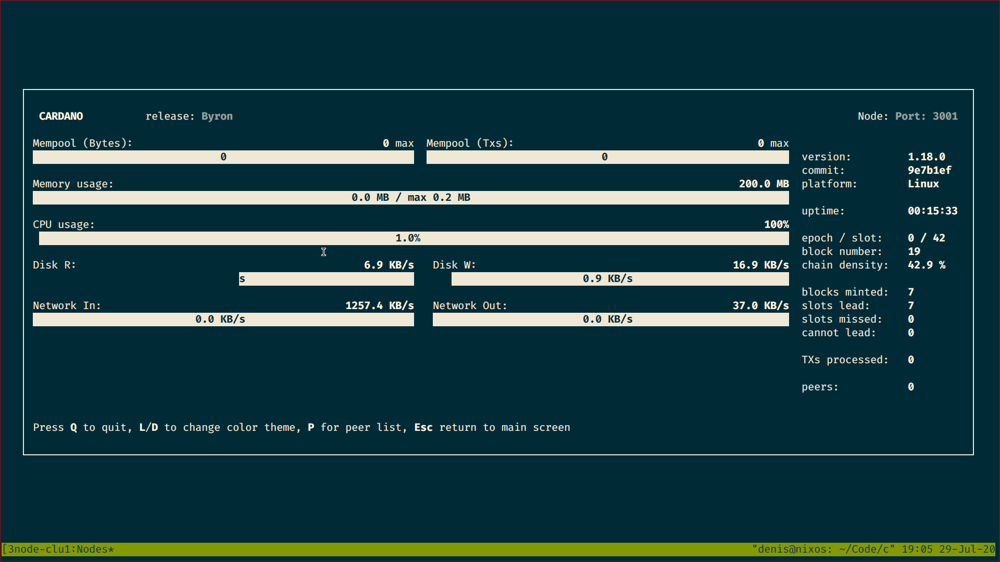
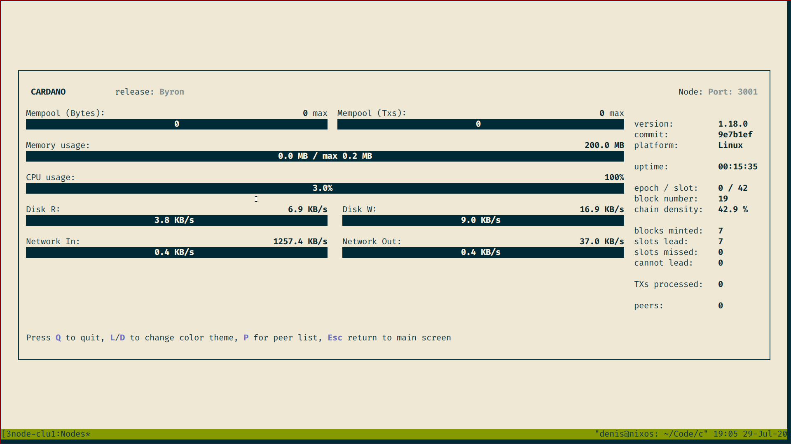

# Monitoring a Node: LiveView Mode

The node can be launched both in `Simple` mode and `LiveView` mode. When the node is launched in `LiveView` mode,
the user sees node's TUI (Textual User Interface) right in the terminal.

Please note that `LiveView` mode can be activated on Unix systems only; it does not work on Windows.

## Node Configuration

To activate `LiveView` mode, please open node's configuration file and find an option `ViewMode`. Set it to `LiveView`:

    ViewMode: LiveView

After starting, you will see the TUI:

## Exit

To stop the node running in `LiveView` mode, press `Q` (or `q`) key. It is possible to stop it using
`Ctrl+C` keys as well.

## Color Theme

It is possible to change the color theme of the TUI.

Press `L` (or `l`) to set the light theme:

Press `D` (or `d`) to set the dark theme (the default one).

## Top Line

The top line of TUI contains two important fields:

1. `release` corresponds to the protocol node uses. For example, `Byron` corresponds to `RealPBFT`.
2. `Port` shows the local port of this node. This port is taken from the topology the node is running with.

## Node Info

The right column of the TUI displays basic node info:

* `version` - node's full version (the same version as from `cardano-node --version` command).
* `commit` - commit node was built from.
* `platform` - the platform node runs on (Linux, Windows, or Darwin).
* `uptime` - the time how long the node is running.

## Blockchain Info

The right column of the TUI displays blockchain info:

* `epoch / slot` - `epoch` shows the number of current epoch, `slot` shows the number of the current slot in this epoch.
* `block number` - the number of the last block in the existing blockchain.
* `chain density` - blockchain density, in percent.

## Forge Info

The right column of the TUI displays forge info:

* `blocks minted` - the number of blocks minted by this node.
* `slots lead` - the number of slots when this node was a leader.
* `slots missed` - the number of slots this node missed as a leader (so block wasn't minted).
* `cannot lead` - the number of cases when this node could not mint a block (for example, because of the invalid key).

## Transactions Info

The right column of the TUI displays transactions info:

* `TXs processed` - the number of processed transactions. Technically it is the number of transactions
  that are _already_ removed from the mempool, so we can treat them as completely processed.

## Peers Info

The right column of the TUI displays peers info:

* `peers` - the number of connected peers.

And if you press `P` (or `p`) key, you will see another TUI window with the list of connected peers.
This list contains information about every peer:

* `Address` - peer's endpoint (IP-address and port).
* `Status` - peer's status (`shutdown`, `aberrant`, `fetching` or `ready`).
* `Slot` - The maximum slot of a block that has ever been in flight for this peer.
* `In flight: Reqs` - the number of block fetch requests that are currently in-flight.
* `In flight: Blocks` - the points for the set of blocks currently in-flight.
* `In flight: Bytes` - the sum of the byte count of blocks expected from all in-flight fetch requests.

To return to the main TUI window, please press `Esc` key.

## Mempool Info

There are two progress bars that display mempool-related info:

* `Mempool (Bytes)` - _real_ mempool's capacity, in bytes.
* `Mempool (Txs)` - _calculated_ mempool's capacity, in transactions.

Please note that the number on `Mempool (Txs)` progress bar shows the number of transactions that _currently_
are in the mempool. After these transactions will be processed, this number will be set to `0` again.

## Resources Info

There are progress bars that display resources used by node's process:

* `Memory usage` - memory used, in MB.
* `CPU usage` - CPU usage, in percents.
* `Disk R` - _read_-operations' rate on the hard drive, in KB/s.
* `Disk W` - _write_-operations' rate on the hard drive, in KB/s.
* `Network In` - _input_-operations' rate on the network, in KB/s.
* `Network Out` - _output_-operations' rate on the network, in KB/s.

Please note that the value at the _right_ corner of the progress bar shows the maximum rate being measured.
