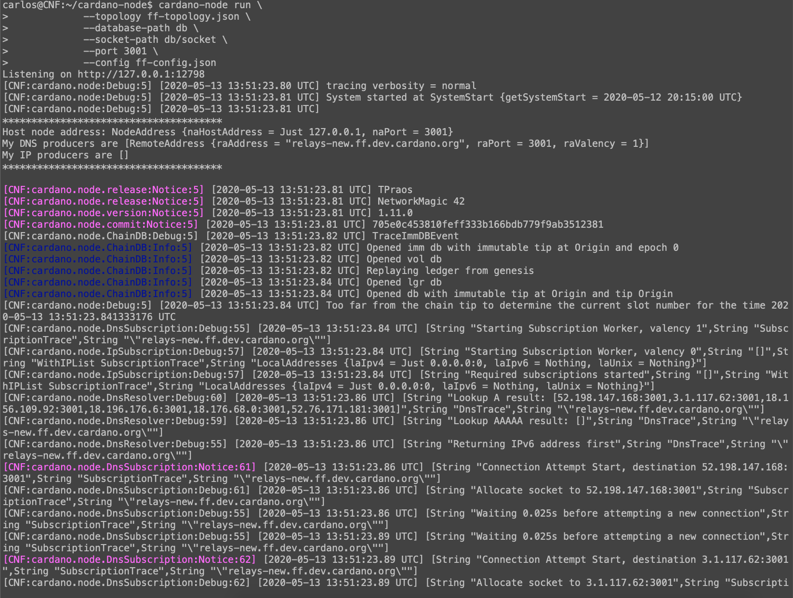

# Configuring Logging

Here we will look at various ways to control _log output_ generated by the node
using the `yaml`-configuration file of the node.
We assume that you have built a node and are able to run it with our own custom configuration, which is described in [this tutorial](build.md)
and in [this tutorial](ekg.md).

When you start the node using the default configuration,
logging is switched on, log output is directed to the console and to a (rolling) file in folder `logs/`,
minimal severity is `Notice`,
and verbosity is _normal_.
We will see how to change all of these and more in this tutorial using various options in the configuration file.

1. We can disable logging completely by setting `TurnOnLoggin` to `False`:

        TurnOnLogging: False

2. Log messages come with different severities (`Debug`, `Info`, `Notice` and `Warning` and `Error`), and we can specify the _minimal_ severity
   of messages that will be passed on (the the console, a file or another logging backend). Messages with a lower severity will be suppressed.
   By changing this minimal severity to `Debug`, we will therefore see messages of all severities;
   by changing it to `Error`, we will only see the most severe messages:

        minSeverity: Debug

   The severity is displayed in the beginning of each log message (in this example, there is one message with severity `Debug`,
   and there are two with severity `Notice`):

   

   __Note:__ Lowering the minimal severity harms _efficiency_,
   so while using a low severity can be very helpful for debugging a problem, it should be used with care during normal operation.
   The same is true for other options which produce more logging output described below.

3. In addition to _severity_, log messages come with _verbosity_, which can be `MinimalVerbosity`, `NormalVerbosity` or `MaximalVerbosity`.
   Changing the verbosity will not change _which_ messages will be displayed, 
   but the amount of information contained in each message.

        TracingVerbosity: MinimalVerbosity

4. As mentioned above, by default log output is directed to the console and to file `logs/mainnet.log`. 
   This behavior is handled by so-called "scribes", 
   which we can configure in sections `defaultScribes` and `setupScribes` of the configuration file.

   Section `defaultScribes` makes types of scribes available.
   By default these types are `FileSK` for writing to a file
   and `StdoutSK` for writing to the console.
   (There are also the types `JournalSK` for `systemd`'s journal system
   and `DevNullSK` for directing the output to nowhere,
   but those are not available by default.)

   Section `setupScribes` lists those scribes that are actually used.
   Their kinds must be configured in the `defaultScribes` section
   before they can be used. For example, if we want logging to go to
   `logs/mylog.log` in Json-format, we can configure this as follows:

        setupScribes:
          - scKind: FileSK
            scName: "logs/mylog.log"
            scFormat: ScJson

   Scribes of type `FileSK` use _rotating_ log files
   (keeping the newest log messages in the configured log file and moving
   older messages to archive files), and the rotation-behavior can be
   configured in section `rotation`.

5. The configuration options discussed until now were all global,
   they effected all subsystems simulatneously.
   It is possible to activate or deactivate logging
   for specific subsystems by setting the corresponding flags
   to `True` or `False` accordingly.
   Those flags can be found in the section starting with the comment
   "`##### Coarse grained logging control #####`".

   For example, if we want to activate logging for all subsystems related
   to block fetching, we can achieve this as follows:

        # Trace BlockFetch client.
        TraceBlockFetchClient: True

        # Trace BlockFetch decisions made by the BlockFetch client.
        TraceBlockFetchDecisions: True

        # Trace BlockFetch protocol messages.
        TraceBlockFetchProtocol: True

        # Serialised Trace BlockFetch protocol messages.
        TraceBlockFetchProtocolSerialised: True

        # Trace BlockFetch server.
        TraceBlockFetchServer: True

6. It is also possible to exert more fine-grained control on what information
   to log, but we will not cover this in this tutorial. 
