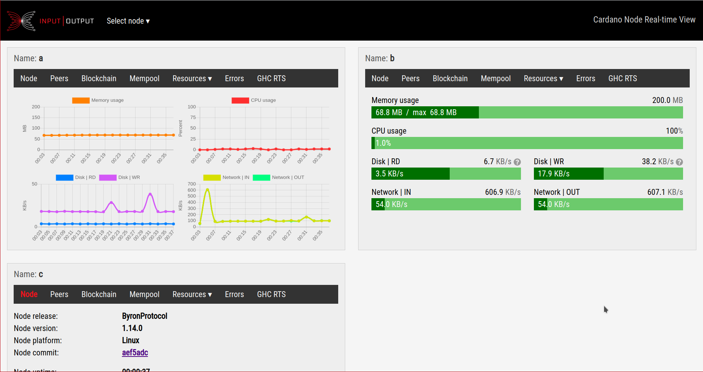

# Monitoring multiple Nodes with RTView

_[RTview](https://github.com/input-output-hk/cardano-benchmarking/tree/master/cardano-rt-view)_ is a service available for _Linux_, _macOS_, and _Windows_ that collects metrics from multiple nodes and displays them in a browser view (usually on http://localhost:8024).

**[Download](https://github.com/input-output-hk/cardano-benchmarking/releases)** - **[Issues](https://github.com/input-output-hk/cardano-benchmarking/issues)** - **[Wiki](https://github.com/input-output-hk/cardano-benchmarking/wiki/Cardano-RTView-Service-overview)**

### Download

Downloads of pre-built packages for each platform are available from the [Releases](https://github.com/input-output-hk/cardano-benchmarking/releases) page.

### Description

Communication between the nodes and the service is using "pipes" on the same host, or can use network sockets to aggregate metrics from different hosts. See our [wiki:Overview](https://github.com/input-output-hk/cardano-benchmarking/wiki/Cardano-RTView-Service-overview) for more information and explanations.

The nodes sending metrics to the service need to be configured accordingly. See our [wiki:Configuration](https://github.com/input-output-hk/cardano-benchmarking/wiki/Cardano-RTView-Service-configuration)
