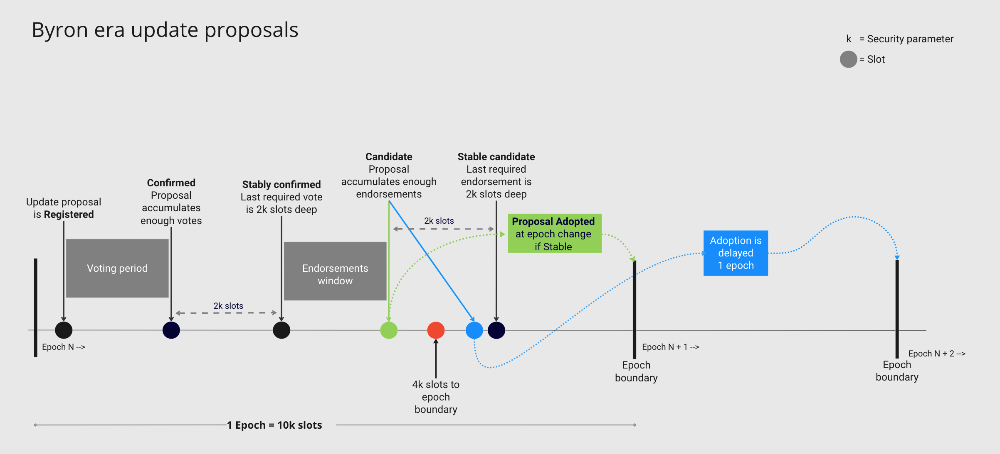
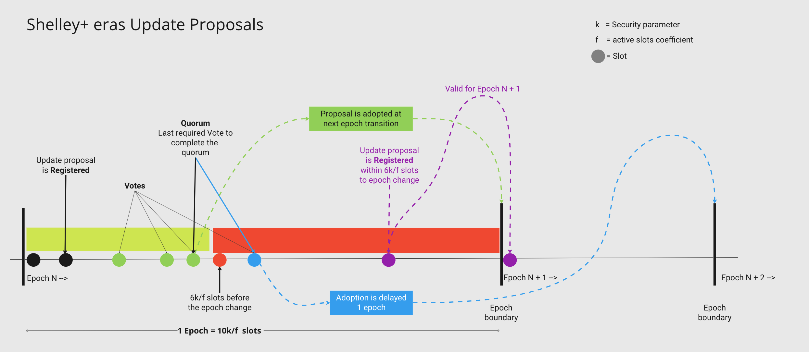

# Cardano governance

Until the [Voltaire era](https://roadmap.cardano.org/en/voltaire/) is released, Cardano has a federated governance mechanism that allows updating the protocol parameters. Such updates are done using an _update proposal_ mechanism. In the current setup, only the holders of the _genesis keys_ can submit and vote on proposals.

Update proposals can be used to introduce changes to the values of specific parameters (e.g., the maximum block size, the maximum transaction size etc.), changes to the validation rules at any level (transaction, block, or blockchain), or even changes at the consensus protocol itself.

Protocol parameters are used to affect the operation of the Cardano protocol. They may be either **updatable** or **non-updatable** the latter known as **Global constants** in the specs. Updatable parameters can be tuned to vary the operation of the block-producing protocol, impacting the proportion of pools that are federated/non-federated, influence of the 'pledge', etc. **Global constants**,  affect the fundamentals of the blockchain protocol, which includes defining the genesis block, basic security properties etc. [CIP-9](https://cips.cardano.org/cips/cip9/) and [CIP-28](https://cips.cardano.org/cips/cip28/) detail which parameters are updatable and which are not.

### Cardano eras

Cardano has come through different development **eras** (see [CIP-59](https://github.com/cardano-foundation/CIPs/tree/master/CIP-0059)) each of which introduced new functionalities. Going from one era to the next requires that new features (which might require changes in the ledger, consensus, network, etc) are incorporated into a new node version. For this, an _update proposal_ must be submitted to trigger the update which is handled by the _hardfork combinator_.


| Era     | Key features                                                                                        | Protocol                        | Protocol Version (Major.Minor) | Hardfork event name            |
| ------- | --------------------------------------------------------------------------------------------------- | -------------------------------- | :-----------------------------: | ------------------------------ |
| Byron   | Settlement<br>Genesis delegation<br>Update mechanism                                                                                                 | <p>Ouroboros-classic<br>PBFT</p> |        <p>0.0<br>1.0</p>        | <p>Genesis<br>Byron reboot</p> |
| Shelley | <p>Decentralization of block production<br>Rewards</p>                                              | TPraos *                          |               2.0               | Shelley                        |
| Allegra | Token locking                                                                                       | TPraos                           |               3.0               | Allegra                        |
| Mary    | Native assets                                                                                       | TPraos                           |               4.0               | Mary                           |
| Alonzo  | Smart contracts with Plutus                                                                         | TPraos                           |        <p>5.0<br>6.0</p>        | <p>Alonzo<br>Alonzo intra era HF</p>                         |
| Babbage | <p>PlutusV2<br>Reference inputs<br>Inline datums<br>Reference scripts<br>Removal of d parameter<br>secp256k1 primitive support</p> | Praos                            |          <p>7.0<br>8.0</p>               | <p>Vasil<br>SECP intra era HF                          |

\* TPraos: Transitional Praos

## Byron era update proposals

In Byron era only _genesis keys_ can sign blocks. Genesis keys can (they do in practice) delegate their signing rights to another key via a _delegation certificate_. Apart from signing blocks, _delegate keys_ can create and vote on update proposals.

The general mechanism for updating protocol parameters in Byron era is as follows:



1. Update proposal is **registered**: An update proposal starts with a special kind of transaction where a _delegate key_ proposes new values for some protocol parameters.

  Updating any protocol parameter *always* requires updating the protocol version according to the following rules:

  * If the proposed major version is equal to the current major version, then the proposed
minor version must be incremented by one.
  * If the proposed major version is larger than the current major version, then the
proposed minor version must be reset to zero.
  * Update proposals that neither increase the protocol version nor the software version are 'invalid' according to the Byron specification, and rejected when submitted.

2. **Accumulate** votes: Delegates sign and submit their votes. The proposal must accumulate a sufficient number of votes to be confirmed.

3. Update proposal is **Confirmed (enough votes)**: The system records the slot number of the slot in which the required threshold of votes was met.

  The _threshold_ is determined by the _minThd_ protocol parameter. When divided by, 1x10<sup>15</sup>, it determines the minimum portion of the total stake that is needed for the adoption of a new protocol version. On mainnet, this number is set to 6x10<sup>14</sup>, so the minimum portion becomes 0.6. This number can be multiplied by the total number of genesis keys to obtain how many keys are needed to reach a majority.

  Once a proposal is _confirmed_, 2k slots (2 times the security parameter k) need to pass for it to be _stably confirmed_.

4. **Stably-confirmed**: When the last required vote is 2k slots deep the proposal is _stably confirmed_.

  At this point, endorsement accumulation starts. A block whose header's protocol version number is that of the proposal is interpreted as an **endorsement**. In other words, the delegate nodes are ready for the upgrade. Once the number of endorsers satisfies a threshold (same as for voting), the confirmed proposal becomes a **candidate proposal**. Endorsements for proposals that are not yet _stably confirmed_ are not invalid but rather silently ignored.

5. **Candidate (enough endorsements)**: Enough delegate nodes have endorsed the proposal. At this point 2k slots need to pass for the proposal to become a _stable candidate_ that can be adopted.

  * If an update proposal for current _Epoch N_ becomes a _candidate_ **earlier** than 4k slots before the end of the epoch, it can be adopted at the epoch transition to _Epoch N+1_ provided it becomes an _stable candidate_.

  * If it becomes a _candidate_, **later** than 4k slots before the end of the epoch, the adoption is delayed 1 epoch until the transition to _Epoch N+2_, provided it becomes an _stable candidate_.

6. **Stable candidate**: The last required endorsement is 2k slots deep.

  If there was no _stable candidate_ proposal by the end of the epoch where the proposal was submitted, it is carried over to the next epoch; in particular, a candidate proposal whose threshold-satisfying endorsement was not yet stable will be adopted at the subsequent epoch unless it is surpassed (by a new proposal) in the meantime.

7. **Update**: Update proposals are adopted at epoch transitions.

### How to create a Byron era update proposal

Cardano-cli provides the necessary tools to create and submit update proposals and votes:

```bash
cardano-cli byron governance
Usage: cardano-cli byron governance COMMAND

  Byron governance commands

Available commands:
  create-update-proposal   Create an update proposal.
  create-proposal-vote     Create an update proposal vote.
  submit-update-proposal   Submit an update proposal.
  submit-proposal-vote     Submit a proposal vote.

```
Here is an example of an update proposal to go from Byron (Ouroboros BFT) to Shelley (TPraos). We increase the protocol version from 1.0.0 to 2.0.0:

```bash
cardano-cli byron governance create-update-proposal \
--filepath update.proposal \
--testnet-magic 42 \
--signing-key byron.delegate.key \
--protocol-version-major "2" \
--protocol-version-minor "0" \
--protocol-version-alt "0" \
--application-name "cardano-sl" \
--software-version-num "1" \
--system-tag "linux" \
--installer-hash 0
```
Then, to submit the update proposal:

```bash
cardano-cli byron governance submit-update-proposal \
--testnet-magic 42 \
--filepath update.proposal
```
 Voting works in a similar way by creating the vote:

```bash
cardano-cli byron governance create-proposal-vote \
--proposal-filepath update.proposal \
--testnet-magic 42 \
--signing-key byron.delegate.key \
--vote-yes \
--output-filepath update.proposal.vote
```
and submitting it:

```bash
cardano-cli byron governance submit-proposal-vote  \
--testnet-magic 42 \
--filepath update.proposal.vote
```
In this case, delegate nodes must be running a node version that is compatible with the protocol version 2.0 to endorse the update.

## Update proposals in Shelley+ eras

There are some changes in the update proposal mechanism in Shelley and later eras: there is no distinction between votes and proposals. To 'vote' for a proposal, a _delegate_ submits the exact same update proposal. Update proposals and votes are submitted in a regular transaction. Also, there is no separate endorsement step.

The procedure is as follows:  



1. **Register** the update proposal: During each epoch, a genesis key can submit (via its delegates) zero, one, or many proposals; each submission overrides the previous one. Proposals can be explicitly marked to be for future epochs; in that case, these are simply not considered until that epoch is reached.

  The window for submitting (and voting) update proposals ends **6k/f** slots before the end of the epoch. Where _k_ is the security parameter and _f_ is the _active slot coefficient_.

2. **Voting**: To vote on an update proposal, _delegates_ sign and submit the exact same update proposal.

3. **Quorum**: The required number of votes for an update proposal to be adopted is reached. For an update proposal on current _Epoch N_,

  * if a **quorum** is reached **earlier** than **6k/f** slots before the end epoch, the proposal is set to be adopted at the transition to Epoch N+1.

  * if a **quorum** is achieved **later** than **6k/f** slots before the end of the epoch, the adoption is delayed one epoch, to the transition to Epoch N+2

4. **Update**: The update is applied at the corresponding epoch transition.

### How to create an update proposal for Shelley and later eras

Cardano-cli provides the necessary tools to make an update proposal:

```bash
cardano-cli governance create-update-proposal

Usage: cardano-cli governance create-update-proposal \
            --out-file FILE
            --epoch NATURAL
            (--genesis-verification-key-file FILE)
            [--protocol-major-version NATURAL --protocol-minor-version NATURAL]
            [--decentralization-parameter RATIONAL]
            [--extra-entropy HEX | --reset-extra-entropy]
            [--max-block-header-size NATURAL]
            [--max-block-body-size NATURAL]
            [--max-tx-size NATURAL]
            [--min-fee-constant LOVELACE]
            [--min-fee-linear NATURAL]
            [--min-utxo-value NATURAL]
            [--key-reg-deposit-amt NATURAL]
            [--pool-reg-deposit NATURAL]
            [--min-pool-cost NATURAL]
            [--pool-retirement-epoch-boundary INT]
            [--number-of-pools NATURAL]
            [--pool-influence RATIONAL]
            [--monetary-expansion RATIONAL]
            [--treasury-expansion RATIONAL]
            [--utxo-cost-per-word LOVELACE]
            [--price-execution-steps RATIONAL --price-execution-memory RATIONAL]
            [--max-tx-execution-units (INT, INT)]
            [--max-block-execution-units (INT, INT)]
            [--max-value-size INT]
            [--collateral-percent INT]
            [--max-collateral-inputs INT]
            [--utxo-cost-per-byte LOVELACE]
            [--cost-model-file FILE]
```
Here is an example of an update proposal to go from Alonzo (protocol version 6.0) to Babbage (protocol version 7.0):

```bash
cardano-cli governance create-update-proposal \
--genesis-verification-key-file non.exteneded.genesis.vkey \
--out-file update.v7.proposal \
--epoch $(cardano-cli query tip --testnet-magic 42 | jq .epoch) \
--protocol-major-version "7" \
--protocol-minor-version "0"
```
Note that:

* Proposal is created using the Non-extended genesis verification key.
* `--epoch` must follow the 6k/f slots before the epoch change rule.
* If the update proposal attempts to change `--protocol-major-version`, it can only be incremented by exactly 1 with respect to the currently adopted version.
* If `--protocol-minor-version` is greater than 0 in the currently adopted version, it must be reset to `0` with the update proposal that attempts to change `--protocol-major-version`.

The update proposal is then submitted in a regular transaction:

```bash
cardano-cli transaction build \
--tx-in TXIN \
--change-address ADDRESS \
--update-proposal-file update.v7.proposal \
--out-file tx.raw
```
We sign with a payment skey (to pay the fee) and a Shelley-era delegate skey:

```bash
cardano-cli transaction sign \
--tx-body-file tx.raw \
--signing-key-file payment.skey \
--signing-key-file delegate.skey \
--out-file tx.signed
```

```bash
cardano-cli transaction submit --testnet-magic 42 \
--tx-file tx.signed
```
### Update proposal failures

Update proposals fail at submission if:

1. The epoch number in the proposal is not appropriate for the slot in the current epoch.  `PPUpdateWrongEpoch`
2. It is not signed by a delegate key. `NonGenesisUpdate`
3. Proposes a protocol version that cannot follow from the current protocol version. `PVCannotFollow`


## Voltaire era

A Cardano Improvement Proposal to shape Voltaire era is being discussed in [CIP-1694](https://github.com/cardano-foundation/CIPs/pull/380).

<br>

# Genesis key re-delegation work flow

1. Convert Byron era genesis key to Shelley era genesis key

```bash
cardano-cli key convert-byron-key \
--byron-genesis-key-type \
--byron-signing-key-file byron.genesis.skey \
--out-file shelley.genesis.skey
```

2. Generate verification and non-extened verification keys

```bash
cardano-cli key verification-key \
--signing-key-file shelley.genesis.skey \
--verification-key-file shelley.genesis.vkey
```
```bash
cardano-cli key non-extended-key \
--extended-verification-key-file shelley.genesis.vkey \
--verification-key-file non.e.shelley.genesis.vkey
```

3. Generate a new delegate key pair

```bash
cardano-cli genesis key-gen-delegate \
--verification-key-file shelley.delegate.vkey \
--signing-key-file shelley.delegate.skey \
--operational-certificate-issue-counter-file shelley.delegate.certificate.counter
```

4. Issue a new delegation certificate  (genesis key delegating to a delegate key). Note that

* A VRF key is required even if the network is already in fully decentralized block production mode.  
* we need the non-extended genesis verification key

```bash
cardano-cli governance create-genesis-key-delegation-certificate \
--genesis-verification-key-file non.e.shelley.genesis.vkey \
--genesis-delegate-verification-key-file shelley.delegate.vkey \
--vrf-verification-key-file vrf.vkey \
--out-file genesis.delegation.cert
```

5. Submit the delegation certificate in a transaction. **The transaction needs to be signed by the Shelley era genesis key** For example

```bash
cardano-cli transaction build
--testnet-magic 42 \
--tx-in $(cardano-cli query utxo --address $(cat payment.addr) --testnet-magic 42 --out-file  /dev/stdout | jq -r 'keys[]') \
--change-address $(cat payment.addr) \
--certificate-file genesis.delegation.cert \
--out-file tx.raw
```
Sign with a payment key and the genesis key that is changing it's delegation
```bash
cardano-cli transaction sign \
--tx-body-file tx.raw \
--signing-key-file payment.skey \
--signing-key-file shelley.genesis.skey \
--out-file tx.signed
```
```bash
cardano-cli transaction submit \
--testnet-magic 42 \
--tx-file tx.signed
```

## Genesis and Delegate keys operations

#### Byron era keys

Generate byron era key, (works for genesis and delegate keys)

```bash
cardano-cli byron key keygen \
--secret byron.genesis.skey
```
Generate byron era verification key (works for genesis and delegate keys)

```bash
cardano-cli byron key to-verification \
--byron-formats \
--secret byron.genesis.skey \
--to byron.genesis.vkey
```
Convert a Byron era genesis key to a Shelley era genesis key

```bash
cardano-cli key convert-byron-key \
--byron-genesis-key-type \
--byron-signing-key-file byron.genesis.skey \
--out-file shelley.genesis.skey
```

For genesis keys in legacy SL format
```bash
cardano-cli key convert-byron-key \
--legacy-byron-genesis-key-type \
--byron-signing-key-file byron.genesis.skey \
--out-file shelley.genesis.skey
```

```json
{
    "type": "GenesisExtendedSigningKey_ed25519_bip32",
    "description": "",
    "cborHex": "5880d87533cf5d8c75331d0d720c2362600073b80fa0efb288b6bf11fc7128f6585f78b6e4c9679df4b5718a78e3cce0d2602e8f9764ffa0953ef88e4c236359bcb635ec2033af7f38b8e72c8179ffe2df6c6b7cca367c9193e5d278d5dfc359fdc32584dad5ab683a812e81bf4ce223db90b40f55c964d30db4fafc5513314aace5"
}
```
Convert a byron era delegate key to a Shelley era delegate key

```bash
cardano-cli key convert-byron-key \
--byron-genesis-delegate-key-type \
--byron-signing-key-file byron.delegate.skey \
--out-file shelley.delegate.skey
```
```json
{
    "type": "GenesisDelegateExtendedSigningKey_ed25519_bip32",
    "description": "",
    "cborHex": "5880a01c08e71365898bfba83aebb824225b3de4429cc64c4f268448adfa2fbf645a3d0ee3be957f8174eb8f196926a55f5a6bcdff3217202e66269bb4ef63983fcb75ea5b6b86f5f55abeb5ef739498887edb063a20a66cca7f1c592ca352ee2c6411943ec90033bbe77bc1816bc0f9a1c6cd2287d3bbd91a3c97ba1098c24c1cd8"
}
```
#### Shelley era keys

Generate Shelley era genesis key

```bash
cardano-cli genesis key-gen-genesis \
--verification-key-file shelley.genesis.vkey \
--signing-key-file shelley.genesis.skey
```

Get the verification key for a Shelley era signing key. Useful for keys converted from Byron era genesis key to a Shelley era key.

```bash
cardano-cli key verification-key \
--signing-key-file shelley.genesis.skey \
--verification-key-file shelley.genesis.vkey
```
```json
{
    "type": "GenesisExtendedVerificationKey_ed25519_bip32",
    "description": "",
    "cborHex": "584035ec2033af7f38b8e72c8179ffe2df6c6b7cca367c9193e5d278d5dfc359fdc32584dad5ab683a812e81bf4ce223db90b40f55c964d30db4fafc5513314aace5"
}
```
Generate a non-extended verification key from a verification key. This key is used in update proposals, delegation certificates, etc.

```bash
cardano-cli key non-extended-key \
--extended-verification-key-file shelley.genesis.vkey \
--verification-key-file non.e.shelley.genesis.vkey
```
```json
{
    "type": "GenesisVerificationKey_ed25519",
    "description": "",
    "cborHex": "582035ec2033af7f38b8e72c8179ffe2df6c6b7cca367c9193e5d278d5dfc359fdc3"
}
```
Generate a new Shelley era delegate key pair

```bash
cardano-cli genesis key-gen-delegate \
--verification-key-file shelley.delegate.vkey \
--signing-key-file shelley.delegate.skey \
--operational-certificate-issue-counter-file shelley.delegate.certificate.counter
```
```json
{
    "type": "GenesisDelegateExtendedSigningKey_ed25519_bip32",
    "description": "",
    "cborHex": "5880a01c08e71365898bfba83aebb824225b3de4429cc64c4f268448adfa2fbf645a3d0ee3be957f8174eb8f196926a55f5a6bcdff3217202e66269bb4ef63983fcb75ea5b6b86f5f55abeb5ef739498887edb063a20a66cca7f1c592ca352ee2c6411943ec90033bbe77bc1816bc0f9a1c6cd2287d3bbd91a3c97ba1098c24c1cd8"
}
```
```json
{
    "type": "GenesisDelegateVerificationKey_ed25519",
    "description": "Genesis delegate operator key",
    "cborHex": "5820e2cd4ddd598ccf42aca51dc0eb8aed761eb8772b35a2035604df4ffcc829cabe"
}
```
```json
{
    "type": "NodeOperationalCertificateIssueCounter",
    "description": "Next certificate issue number: 0",
    "cborHex": "82005820e2cd4ddd598ccf42aca51dc0eb8aed761eb8772b35a2035604df4ffcc829cabe"
}
```
Issue a delegation certificate
```bash
cardano-cli governance create-genesis-key-delegation-certificate \
--genesis-verification-key-file shelley.genesis.ne.vkey \
--genesis-delegate-verification-key-file shelley.delegate.vkey \
--vrf-verification-key-file vrf.vkey \
--out-file genesis.delegation.cert
```
