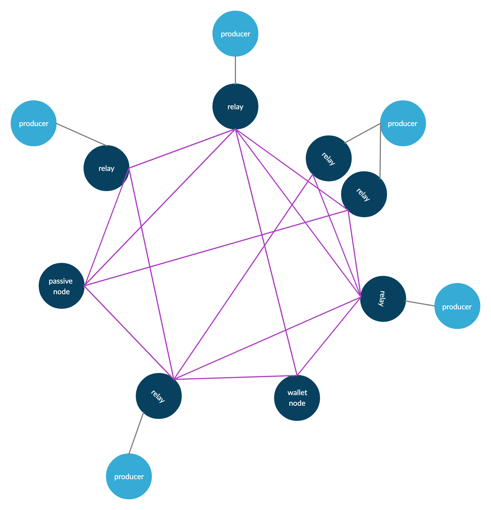

# Generate your stake pool keys

A stake pool needs at least 2 running nodes: A __block-producing__ node and a __relay__ node.

We need to setup our __block-producing__ node. You can build the node from source on each server or maintain a single build on your local machine and only upload the binaries to your __block-producing__ and __relay__ servers. Make sure you have consistent versions across them.

The __block-producing__ node will hold your KES and VRF keys and the operational certificate. It should only connect with its __relay__, while the __relay__ will establish connections with other relays in the network.  Each node must run in an independent server.

For your own security, we recommend the following *as a minimum*. You should also take steps to encrypt any disks or other storage, make sure that servers cannot be booted from the network or removable media, and monitor attempts to connect to your system, of course.

#### Basic block-producing node firewall configuration:

* Make sure you can only login with SSH Keys, not a password.
* Make sure to setup SSH connections to a port that is different from the default SSH port (22).
* Make sure to configure the firewall to only allow connections from your relay nodes by setting up their IP addresses.

#### Basic relay node firewall configuration:

 * Make sure you can only login with SSH Keys, not a password.
 * Make sure to setup SSH connections to a port that is different from the default SSH port (22).
 * Make sure you only have the strictly necessary ports opened (ideally the incoming port to the relay, plus the outgoing ports to the external
nodes, plus any ports that are needed for SSH connections and/or local administration).  

#### Creating keys for our block-producing node

**WARNING:**
It is best practice to use an __offline local machine__ for this process (it needs to have `cardano-node` and `cardano-cli` installed). Make sure the machine is not online during key generation, and until you have put your __cold keys__ in secure storage and securely deleted the corresponding files from your local machine. If possible, it is best practice to *never* connect this machine to the internet.

The __block-producing node__ or __pool node__ needs:

* __Cold__ key pair,
* __VRF__ Key pair,
* __KES__ Key pair,
* __Operational Certificate__

Create a directory on your local machine to store your keys:

    mkdir pool-keys
    cd pool-keys

#### Generate __Cold__ Keys and a __Cold_counter__:

    cardano-cli shelley node key-gen \
    --cold-verification-key-file cold.vkey \
    --cold-signing-key-file cold.skey \
    --operational-certificate-issue-counter-file cold.counter

#### Change permissions for your cold keys to prevent accidental deletion.

    chmod 400  cold.vkey cold.skey

#### Generate VRF Key pair

    cardano-cli shelley node key-gen-VRF \
    --verification-key-file vrf.vkey \
    --signing-key-file vrf.skey

#### Change permissions for your cold keys to prevent accidental deletion.

    chmod 400  vrf.vkey vrf.skey

#### Generate the KES Key pair

    cardano-cli shelley node key-gen-KES \
    --verification-key-file kes.vkey \
    --signing-key-file kes.skey

#### Change permissions for your cold keys to prevent accidental deletion.

    chmod 400  kes.vkey kes.skey

#### Generate the Operational Certificate

We need to know the slots per KES period. We can get this from the genesis file:

    cat mainnet-shelley-genesis.json | grep KESPeriod
    > "slotsPerKESPeriod": 3600,

Then we need the current tip of the blockchain:

    cardano-cli shelley query tip --mainnet
    {
    "blockNo": 36929,
    "headerHash": "44c2a2be237ea485c15bf2a50c12b4d2aabe6d4233cb1b2131efc080615a17d0",
    "slotNo": 906528
    }

Look for Tip `slotNo` value. In this example we are on slot 906528. So the KES period is 120:

    expr 906528 / 3600
    > 251

To generate the certificate:

    cardano-cli shelley node issue-op-cert \
    --kes-verification-key-file kes.vkey \
    --cold-signing-key-file cold.skey \
    --operational-certificate-issue-counter cold.counter \
    --kes-period 120 \
    --out-file node.cert

#### Move the cold keys to secure storage and remove them from your local machine.

The best place for your cold keys is a __SECURE USB__ or other __SECURE EXTERNAL DEVICE__, not a computer with internet access.

#### Copy the files to the server:

Copy your VRF keys, KES Keys, and Operational Certificate to your __block-producing__ server. For example:

    scp -rv -P<SSH PORT> -i ~/.ssh/<SSH_PRIVATE_KEY> ~/pool-keys USER@<PUBLIC_IP>:~/

    > Transferred: sent 3220, received 6012 bytes, in 1.2 seconds
    Bytes per second: sent 2606.6, received 4866.8
    debug1: Exit status 0

Log in to your server and verify that the files are there:

    ls pool-keys

    > kes.skey  kes.vkey  node.cert  vrf.skey  vrf.vkey  

Later on we will learn how to register our pool in the blockchain.
